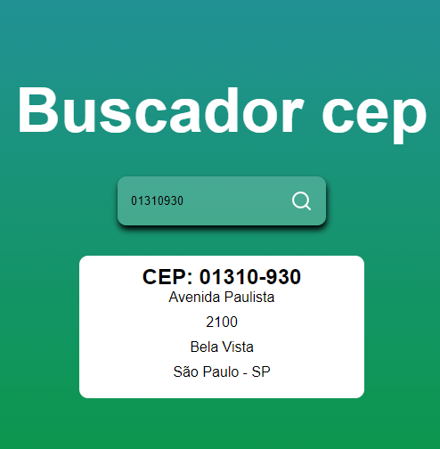

# buscador-Cep

# Para criar o projeto foram necessárias as tecnologias abaixo:
- Vite: Ferramenta para criação de projetos front-end com o objetivo de oferecer uma experiência mais rápida e leve.

- Javascript: Linguagem de programação baseada em scripts com tipagem dinâmica fraca.

- React:É uma biblioteca front-end onde os componentes podem ser facilmente utilizados e compartilhados nas mais diferentes partes da aplicação.

- React-icons: Biblioteca que auxilia na inserção de icones nas páginas do projeto.

- Axios: É uma biblioteca que auxilia no envio e recebimento de requisições http.

- Api: Viacep - Webservice de consultas de cep do Brasil.

